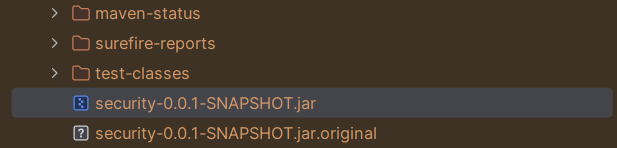
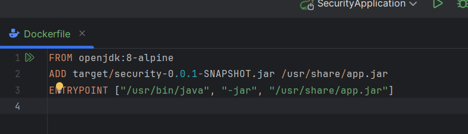
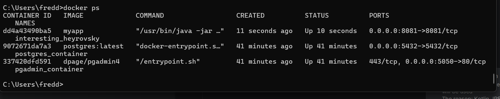
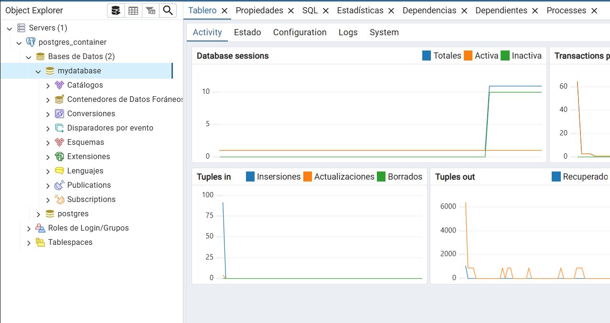
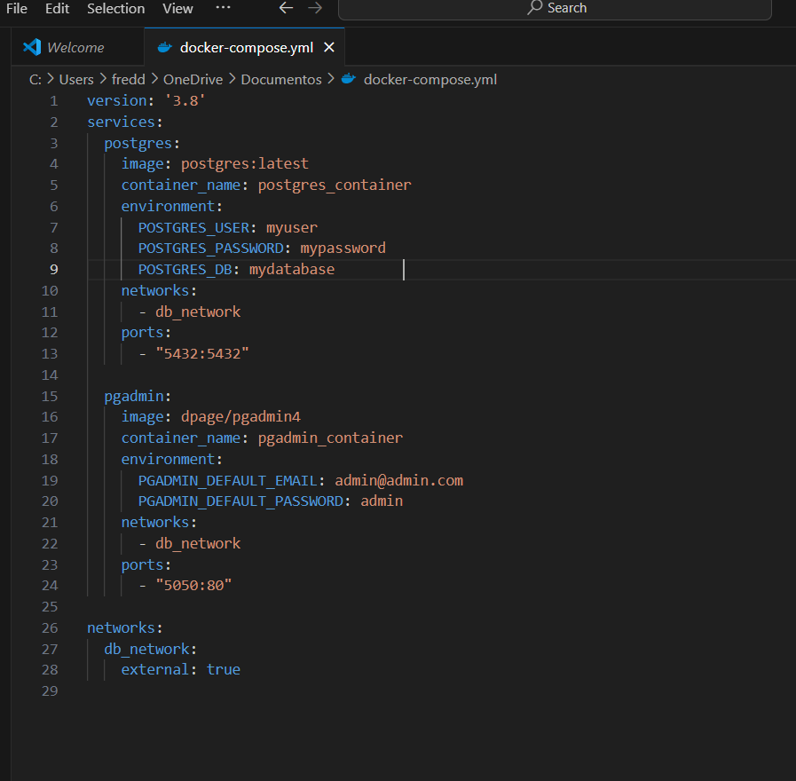
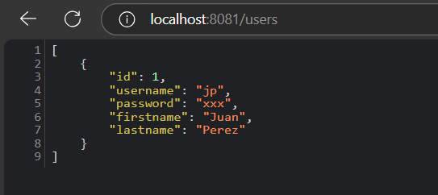

# Práctica: Implementación de un Servidor Web con Docker y Spring Boot

## 1. Título

**Despliegue de una Aplicación Web con Docker y Spring Boot**

---

## 2. Tiempo de duración

**120 minutos**

---

## 3. Fundamentos

Docker es una plataforma que permite empaquetar, distribuir y ejecutar aplicaciones en contenedores. Los contenedores son ligeros, portátiles y consisten en una aplicación junto con todas sus dependencias, lo que garantiza su ejecución en cualquier entorno donde Docker esté habilitado.

### **Conceptos clave**

1. **Dockerfile**: Es un archivo de texto que contiene un conjunto de instrucciones para crear una imagen de Docker. Estas instrucciones indican qué sistema operativo base usar, qué archivos copiar, y qué comandos ejecutar.
   
2. **Docker Compose**: Herramienta que permite definir y ejecutar aplicaciones multicontenedor usando un archivo YAML. Es útil para orquestar varios servicios que trabajan juntos, como un servidor web y una base de datos.
   
3. **Spring Boot**: Es un framework de Java que facilita el desarrollo de aplicaciones independientes y listas para producción, con una configuración mínima.

### **Proceso de integración**

Para esta práctica, empaquetamos una aplicación Spring Boot en un archivo `.jar` (Java Archive) y creamos una imagen de Docker para contenerla. Luego, usamos Docker Compose para configurar una base de datos PostgreSQL y conectar la aplicación a ella.


---

## 4. Conocimientos previos

Para realizar esta práctica, se requieren conocimientos sobre:
- Uso básico de Docker y Docker Compose.
- Familiaridad con Maven para compilar proyectos Java.
- Conceptos básicos de Spring Boot.
- Comandos básicos de terminal en Windows o Linux.

---

## 5. Objetivos a alcanzar

- Crear y ejecutar contenedores Docker para una aplicación web.
- Configurar un entorno con múltiples servicios mediante Docker Compose.
- Implementar una conexión entre una aplicación Spring Boot y una base de datos PostgreSQL.

---

## 6. Equipo necesario

- Computadora con sistema operativo Windows, Linux o macOS.
- Docker Desktop (versión 20.x o superior).
- JDK 8 o superior.
- Maven 3.x.
- Editor de texto o IDE para editar archivos YAML y Java.

---

## 7. Material de apoyo

- [Documentación oficial de Docker](https://docs.docker.com/).
- [Documentación de Spring Boot](https://spring.io/projects/spring-boot).
- [Guía de la asignatura].
- [Docker Compose Cheatsheet](https://devhints.io/docker-compose).

---

## 8. Procedimiento

### **Paso 1: Configuración del proyecto Spring Boot**

1. Configura el archivo `application.yml` con los siguientes valores para conectar la aplicación a PostgreSQL:
   ```yaml
   spring:
     datasource:
       url: jdbc:postgresql://${SERVERDB}:${PORT}/${DB}
       username: ${USERDB}
       password: ${PASSDB}

2.Empaqueta el proyecto en un archivo .jar ejecutando
  




### **Paso 2: Creación del Dockerfilet**

Creamos un archivo Dockerfile en la raíz del proyecto con el siguiente contenido:
FROM openjdk:8-alpine
ADD target/security-0.0.1-SNAPSHOT.jar /usr/share/app.jar
ENTRYPOINT ["/usr/bin/java", "-jar", "/usr/share/app.jar"]



### **Paso 3: Construccion de la imagen de docker**

docker build -t myapp .





### **Paso 4: Configuracion del entorno DockerCompose**

Crea un archivo docker-compose.yml con el siguiente contenido:





### **Paso 5: Verificamos que los contenedores esten levantados**




Crear la red: docker network create my_network

Levantamos: docker-compose up -d


### **Paso 6: Validación**
Abrimos el navegador y accedemoa a http://localhost:8081/users para verificar que el servicio esté funcionando.


### 9. Resultados esperados

La aplicación debe ser accesible en el navegador mediante la URL proporcionada y debe interactuar correctamente con la base de datos PostgreSQL.




### 10. Bibliografía
Docker. (n.d.). Docker Documentation. Retrieved from https://docs.docker.com/.
Spring Boot. (n.d.). Spring Boot Documentation. Retrieved from https://spring.io/projects/spring-boot.
Oracle. (n.d.). Java SE Documentation. Retrieved from https://docs.oracle.com/javase/.

